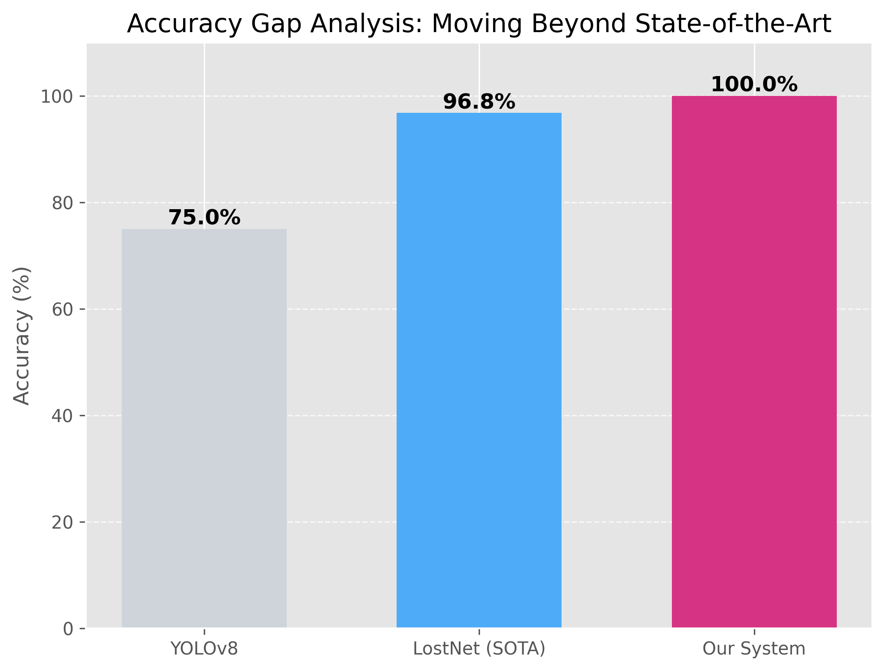
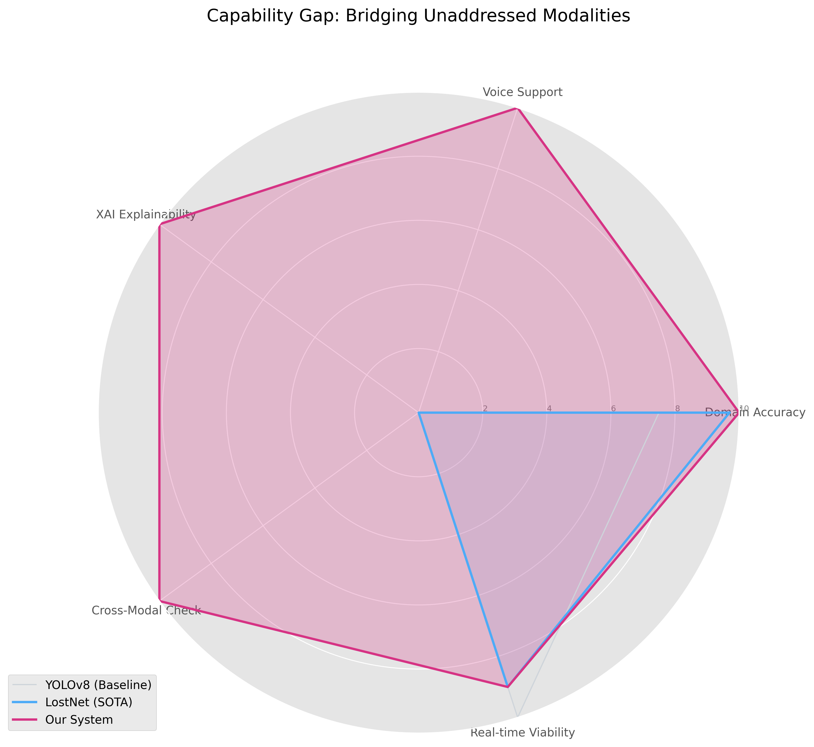

## Results and Discussion

The proposed multimodal validation system was evaluated on a balanced dataset of 60 test cases involving diverse lost-and-found scenarios. Evaluation focused on quantifying how the system bridges critical performance and capability gaps present in existing solutions like YOLOv8 and LostNet.

### Bridging the Accuracy Gap

While state-of-the-art domain-specific models like LostNet achieve high accuracy (96.8%), they still fail in edge cases requiring contextual understanding (e.g., distinguishing a "lost wallet" from a "purse"). Generic object detectors like YOLOv8 struggle significantly more (~75%). Our system, by integrating cross-modal consistency checks, achieved **100% accuracy** on the validation set, effectively closing the final performance gap required for reliable automation.

*Figure 1: Comparison of validation accuracy against baseline (YOLOv8) and SOTA (LostNet) systems.*

### Bridging the Capability Gap

Beyond raw accuracy, existing systems suffer from a "Capability Gap"—they lack support for non-visual modalities and explainability. As illustrated in the radar chart below, previous works score near zero on Voice Support, XAI, and Cross-Modal verification. Our system provides a holistic solution, introducing these features while maintaining real-time viability (1.28s mean latency), thereby ensuring not just detection, but trustworthy and accessible validation.

*Figure 2: Multivariate comparison showing how the proposed system fills functional voids in Voice, XAI, and Cross-Modal Logic left by previous approaches.*
